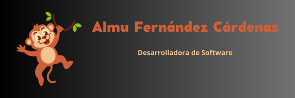
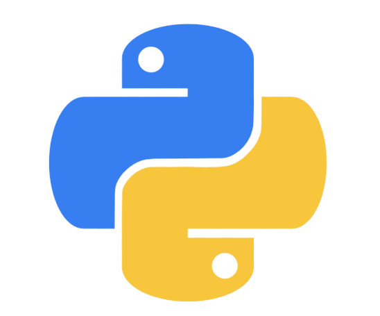
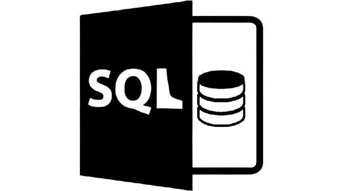
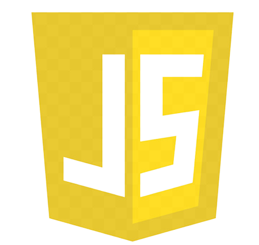
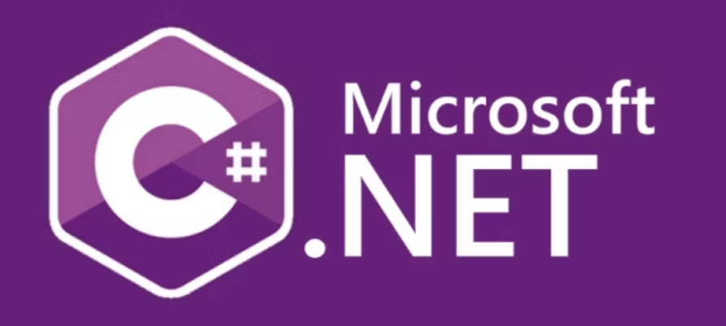
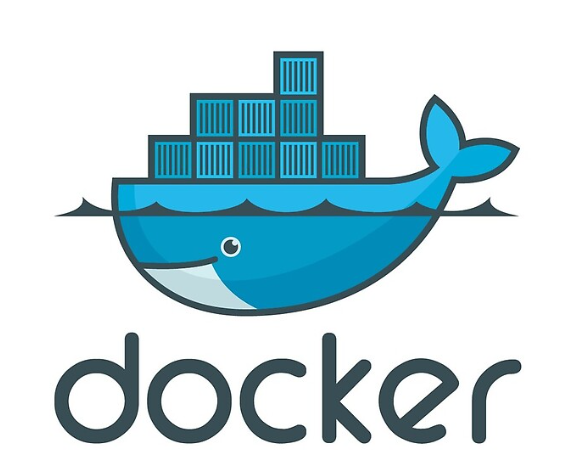
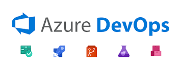

### Hi, I'm Almudena Fernández Cárdenas👋

<!--
**AlmuFerCar/AlmuFerCar** is a ✨ _special_ ✨ repository because its `README.md` (this file) appears on your GitHub profile.-->

## About me
- 💻Software developer (full stack)
- 📲 Mobile developer
- 👓Soul of criminology

### Contact:

### Programming Languages:

### Other useful tools for software development:

### ⚙️ &nbsp;GitHub Analytics

